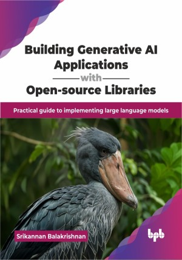

# Building Generative AI Applications with Open-source Libraries

Practical guide to implementing large language models.

This is the repository for [Building Generative AI Applications with Open-source Libraries
](https://bpbonline.com/products/building-generative-ai-applications-with-open-source-libraries?_pos=1&_sid=4fe95633e&_ss=r&variant=44561350525128?variant=44561350525128),published by BPB Publications.

## About the Book
Generative AI is revolutionizing how we interact with technology, empowering us to create everything from compelling text to intricate code. This book is your practical guide to harnessing the power of open-source libraries, enabling you to build cutting-edge generative AI applications without needing extensive prior experience.

In this book, you will journey from foundational concepts like natural language processing and transformers to the practical implementation of large language models. Learn to customize foundational models for specific industries, master text embeddings, and vector databases for efficient information retrieval, and build robust applications using LangChain. Explore open-source models like Llama and Falcon and leverage Hugging Face for seamless implementation. Discover how to deploy scalable AI solutions in the cloud while also understanding crucial aspects of data privacy and ethical AI usage.

By the end of this book, you will be equipped with technical skills and practical knowledge, enabling you to confidently develop and deploy your own generative AI applications, leveraging the power of open-source tools to innovate and create.

## What You Will Learn
• Building AI applications using LangChain and integrating RAG.

• Implementing large language models like Llama and Falcon.

• Utilizing Hugging Face for efficient model deployment.

• Developing scalable AI applications in cloud environments.

• Addressing ethical considerations and data privacy in AI.

• Practical application of vector databases for information retrieval.
